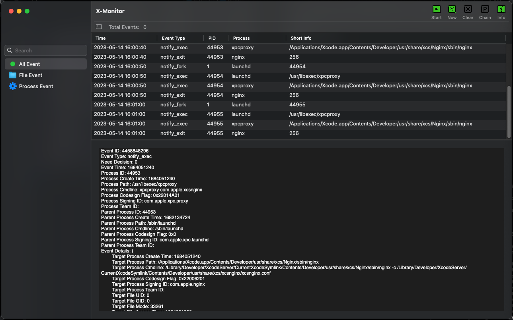

> This README is translated from README_CN by ChatGPT.

  
   <h2 align="center">X-Monitor</h2>

  
X-Monitor is an open-source, extensible event monitoring tool for macOS that provides security professionals with the ability to perform process behavior auditing. It is implemented natively in Objective-C.

    
    
    
    

# Deny process And Low version macOS
If you need:
1. Deny new process execve.
2. 10.12 ~ 10.14 macOS support.

You can use [NuwaStone](https://github.com/ConradSun/NuwaStone), this project supports deny new process that has no signature.

> NuwaStone may merge with X-Monitor in the future and move to [Macintosh-Mystery](https://github.com/Macintosh-Mystery) organization.

# Feature
Current support:

1. It currently supports: notify_exit, notify_exec, notify_fork, notify_open, notify_unlink, notify_rename events from the `Endpoint Security` framework.
2. It support event classification according to the event type.

It will support in the future:

1. All events from the `Endpoint Security` framework. (H1 priority)
2. Event filter. (H1 priority)
3. Process chain analysis. (H2 priority)
4. Network connection and DNS events from the `Network Extension` framework. (H2 priority)
5. Save events to local disk. (H3 priority)

# Installation
X-Monitor can be built from source code or installed from pre-compiled binaries.

## Build
Required Xcode Version 14.3.

# Usage
## System Requirements
X-Monitor is designed to support macOS 10.15 and above.

During the project creation, consideration was given to using Kernel Extensions (KEXT) to support systems from 10.12 to 10.14. However:

1. KEXT is deprecated.
2. KEXT's event support is far less than SEXT (from Endpoint Security).

Therefore, after careful consideration, the development plan for KEXT has been indefinitely postponed.

## Notes
Due to the lack of corresponding Entitlements for X-Monitor developers, please disable SIP.

## Start Event Monitor
1. Click the "start" button to begin monitoring events. Subscription settings can be configured through `X-Monitor` -> `Settings` in the menu.
2. Clicking on a specific row will display detailed information about the event.

## Uninstallation
Simply move X-Monitor to the trash bin.

# Support
If you encounter any issues while using X-Monitor, please feel free to submit an issue.

# Other Pending Tasks
1. Unit testing.
2. Documentation writing.
3. Implement system extension XPC peer signing verification.
4. Optimize performance of NSTableView used for displaying events.