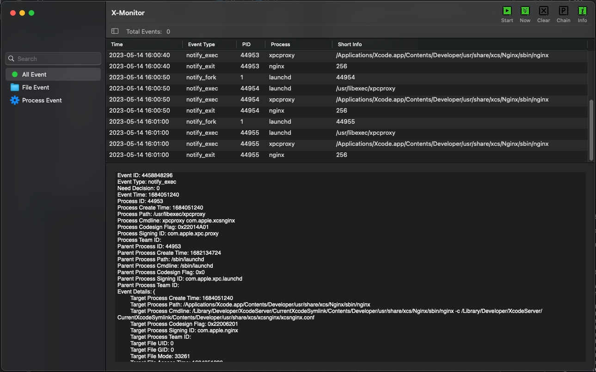

> This README is translated from README_CN by GLM5.1.

  
   <h2 align="center">X-Monitor</h2>

  
X-Monitor is an open-source, extensible macOS event monitoring tool natively implemented in Objective-C, providing security professionals with process behavior auditing capabilities. Note: The majority of X-Monitor's codebase dates back to 2023, so 99% of it is hand-written rather than AI-generated 😊.

    
    
    
    

# Features
Currently supported:
1. `notify_exec`,`notify_open`,`notify_fork`,`notify_close`,`notify_create`,`notify_exchangedata`,`notify_exit`,`notify_get_task`,`notify_kextload`,`notify_kextunload`,`notify_link`,`notify_mmap`,`notify_mprotect`,`notify_mount`,`notify_unmount`,`notify_iokit_open`,`notify_rename`,`notify_setattrlist`,`notify_setextattr`,`notify_setflags`,`notify_setmode`,`notify_setowner`,`notify_signal`,`notify_unlink`,`notify_write`,`notify_file_provider_materialize`,`notify_file_provider_update`,`notify_readlink`,`notify_truncate`,`notify_lookup`,`notify_chdir`,`notify_getattrlist`,`notify_stat`,`notify_access`,`notify_chroot`,`notify_utimes`,`notify_clone`,`notify_fcntl`,`notify_getextattr`,`notify_listextattr`,`notify_readdir`,`notify_deleteextattr`,`notify_fsgetpath`,`notify_dup`,`notify_settime`,`notify_uipc_bind`,`notify_uipc_connect`,`notify_setacl`,`notify_pty_grant`,`notify_pty_close`,`notify_proc_check`,`notify_searchfs`,`notify_proc_suspend_resume`,`notify_cs_invalidated` events from the `Endpoint Security` framework.
2. Event classification by event type.

Planned features:
1. Support for `all events` from the `Endpoint Security` framework (H1 priority). X-Monitor is designed to be extensible, making it straightforward to add new events — for example, see [Add set extend attribute event](https://github.com/lyq1996/X-Monitor/commit/cd659bbb7fbf4d6a26abf675a7e623fd341f4855), which only requires parsing the event-specific attributes in the handler.
2. Event filtering (H1 priority).
3. Process chain analysis (H2 priority).
4. Network connection and DNS events from the `Network Extension` framework (H2 priority).
5. Local event persistence (H3 priority).
6. Process blocking (H3 priority).

# Installation
X-Monitor can be built from source or installed from a pre-compiled binary available in the releases.

## Building from Source
Requires Xcode 14.3 or later.

### Xcode 14.x
Configure your own code signing identity and build directly.

### Xcode 26 (Xcode 16+)
Xcode 26 imposes new restrictions on Ad-Hoc signing with Entitlements, requiring a Provisioning Profile. This project works around it as follows:
1. `CODE_SIGNING_ALLOWED = NO` is set in the Build Settings for X-Monitor and X-Service, disabling Xcode's automatic code signing.
2. A Run Script Build Phase named "Resign with Entitlements" is added, which uses `codesign --force --deep --sign - --entitlements` to perform Ad-Hoc re-signing and inject the Entitlements into the app and system extension after the build completes.

With Xcode 26, simply build the project — no additional configuration is needed.

## Installing from Release

## System Requirements
X-Monitor is designed to support macOS 10.15 and later.

During initial development, Kernel Extensions (KEXT) were considered for supporting macOS 10.12 through 10.14. However:
1. KEXT is deprecated.
2. KEXT supports far fewer events compared to SEXT (from `Endpoint Security`).

Consequently, the KEXT development plan has been shelved indefinitely.

## Important Notes
1. Since X-Monitor's developers do not hold the required `Entitlements`, you must disable SIP to use this application.
2. You may encounter the alert: `X-Monitor was not opened because it contains malware. This action did not harm your Mac.` To resolve this, run the following command in Terminal: `xattr -cr /path/to/X-Monitor.app`

## Getting Started

1. Click `start` on the interface to begin monitoring events. You can configure event subscriptions via `X-Monitor` → `Settings` in the menu bar.
2. Click on any row to view detailed event information.

## Uninstallation
X-Monitor does not leave any local files behind. Simply move it to the Trash — the associated System Extension will be removed automatically.

# Support
If you encounter any issues while using X-Monitor, feel free to open an issue.

# Other Pending Tasks
1. Unit testing;
2. Documentation;
3. System Extension XPC peer signature verification (custom implementation);
4. ~~Optimize the performance of the NSTableView used for displaying events.~~ (Completed)
