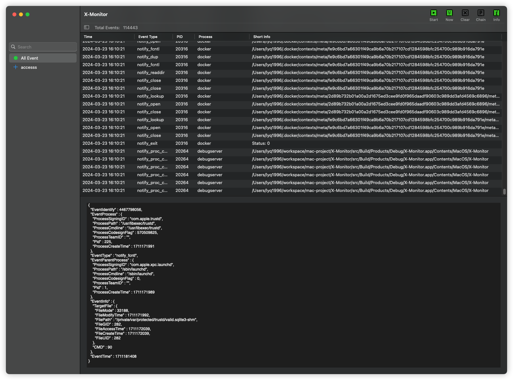

> This README is translated from README_CN by ChatGPT.

  
   <h2 align="center">X-Monitor</h2>

  
X-Monitor is an open-source, extensible event monitoring tool for macOS that provides security professionals with the ability to perform process behavior auditing. It is implemented natively in Objective-C.

    
    
    
    

# Feature
Current support:

1. It currently supports: notify_exit, notify_exec, notify_fork, notify_open, notify_unlink, notify_rename events from the `Endpoint Security` framework.
2. It support event classification according to the event type.

It will support in the future:

1. All events from the `Endpoint Security` framework (incomplete).
2. Network connection and DNS events from the `Network Extension` framework (incomplete).
3. Process chain analysis (incomplete).

# Installation
X-Monitor can be built from source code or installed from pre-compiled binaries.

## Build
Required Xcode Version 14.3.

# Uninstallation
Simply move the application to the Trash.

# Usage
As the X-Monitor developers do not have the necessary `Endpoint Security` entitlements, please disable System Integrity Protection (SIP) when using it.

1. Click `Start` to begin monitoring events. Event subscriptions can be set by `X-Monitor`->`Settings`.
2. Clicking on a specific row will display the detailed information about the event.

# Support
If you encounter any issues when using X-Monitor, please feel free to raise them.

# To-Do List
1. Complete the parsing of all Endpoint Security events (there are too many, I need help!).
2. Add network connection and DNS event producers to X-Service.
3. Process chain analysis.
4. Unit testing.
5. Document writing.
6. Implementation of event blocking mechanism.
7. System Extension peer XPC signature verification (self-implemented).
8. Optimize the performance of the NSTableView used to display events.
